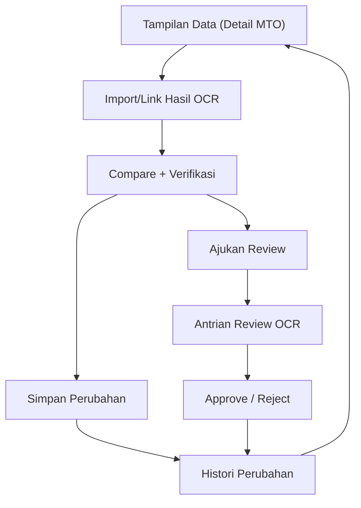

## 1. Product Overview
Integrasi hasil OCR MTO ke Tampilan Data untuk mempercepat input dan meningkatkan akurasi.
Fokus pada penyimpanan metadata OCR, validasi/flag review, histori perubahan, serta UI compare + verifikasi.

## 2. Core Features

### 2.1 User Roles
| Role | Registration Method | Core Permissions |
|------|---------------------|------------------|
| Operator | Menggunakan akun internal yang sudah ada | Mengunggah/menautkan hasil OCR, melihat hasil compare, mengusulkan perubahan, memberi flag review |
| Reviewer | Menggunakan akun internal yang sudah ada | Memverifikasi per-field/per-item, approve/reject, memberi catatan, melihat histori perubahan |

### 2.2 Feature Module
Produk ini terdiri dari halaman utama berikut:
1. **Tampilan Data (Detail MTO)**: ringkasan dokumen MTO, panel hasil OCR, compare per-field, verifikasi & simpan, flag untuk review.
2. **Antrian Review OCR**: daftar item/dokumen yang butuh review, filter & prioritas, review cepat.
3. **Histori Perubahan**: audit trail perubahan data (dari OCR maupun manual), diff perubahan, restore versi (opsional).

### 2.3 Page Details
| Page Name | Module Name | Feature description |
|-----------|-------------|---------------------|
| Tampilan Data (Detail MTO) | Header dokumen | Menampilkan metadata dokumen (ID, tanggal, sumber, status OCR, status verifikasi) dan tombol aksi utama (Import/Link OCR, Simpan, Ajukan Review). |
| Tampilan Data (Detail MTO) | Import/Link hasil OCR | Mengaitkan hasil OCR ke dokumen MTO (upload JSON/hasil ekstraksi) dan menyimpan metadata OCR (engine, versi model, waktu proses, file sumber, halaman). |
| Tampilan Data (Detail MTO) | Mapping field OCR → Data | Memetakan field minimum untuk line item: nama item, spesifikasi (multi-line), size, quantity, unit + confidence per field; menyimpan nilai mentah dan nilai ter-normalisasi. |
| Tampilan Data (Detail MTO) | UI Compare + Verifikasi | Membandingkan nilai OCR vs nilai data saat ini per-field (highlight perubahan); aksi per-field: Terima OCR, Pertahankan, Edit; aksi per-item: Terima semua, Tandai butuh review. |
| Tampilan Data (Detail MTO) | Validasi & aturan flag | Memvalidasi format dan konsistensi (mis. quantity numerik, unit valid, size terisi); memberi flag otomatis jika confidence < ambang, field kosong, atau konflik dengan data eksisting. |
| Tampilan Data (Detail MTO) | Penyimpanan & histori perubahan | Menyimpan perubahan ke data item, sekaligus mencatat histori (sebelum/sesudah, siapa, kapan, sumber perubahan: OCR/manual, alasan/catatan). |
| Tampilan Data (Detail MTO) | Status verifikasi | Mengelola status item: Draft → Perlu Review → Disetujui/ Ditolak; menampilkan siapa reviewer dan catatan keputusan. |
| Antrian Review OCR | Daftar & filter | Menampilkan item/dokumen berstatus Perlu Review; filter berdasarkan dokumen, tanggal, confidence rendah, field bermasalah, reviewer (opsional). |
| Antrian Review OCR | Review cepat | Membuka mode review ringkas: compare per-item, approve/reject, catatan, dan simpan batch. |
| Histori Perubahan | Timeline audit | Menampilkan timeline perubahan per dokumen/per item (timestamp, actor, sumber, ringkasan field berubah). |
| Histori Perubahan | Detail diff | Menampilkan diff before/after untuk satu revisi (termasuk perubahan spesifikasi multi-line) dan konteks (OCR run ID, confidence ringkas). |
| Histori Perubahan | Restore (opsional) | Mengembalikan nilai item ke revisi sebelumnya dengan pencatatan revisi baru (restore action). |

## 3. Core Process
**Operator Flow**
1) Buka Tampilan Data untuk dokumen MTO.
2) Import/Link hasil OCR.
3) Sistem melakukan mapping field, normalisasi, dan validasi; item berconfidence rendah/konflik otomatis ditandai.
4) Operator melakukan compare dan (opsional) menerima sebagian perubahan; sisanya diajukan untuk review.

**Reviewer Flow**
1) Buka Antrian Review OCR untuk melihat item/dokumen yang perlu review.
2) Review compare per-field, lakukan edit bila perlu, lalu approve/reject dengan catatan.
3) Semua keputusan dan perubahan tercatat pada Histori Perubahan.

