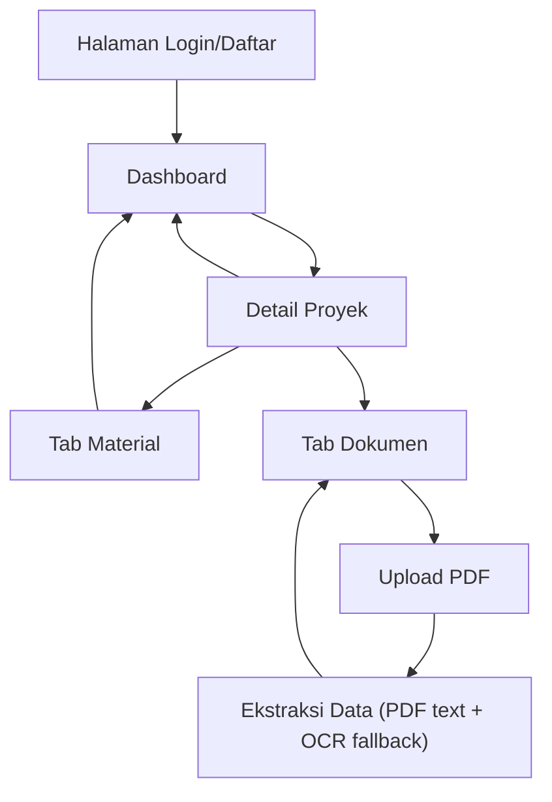

## 1. Product Overview

PGN DataLens adalah aplikasi untuk mengunggah dokumen PDF, mengekstrak data (teks langsung + OCR fallback), dan mengelola proyek beserta material & dokumennya.
Targetnya mempercepat input data dari dokumen PDF dan memusatkan tracking proyek/material/dokumen dalam satu dashboard.

## 2. Core Features

### 2.1 User Roles

| Role                 | Registration Method                                             | Core Permissions                                                                           |
| -------------------- | --------------------------------------------------------------- | ------------------------------------------------------------------------------------------ |
| User (Authenticated) | Login/daftar via Supabase Auth (email/password) melalui backend | CRUD proyek miliknya, upload dokumen, jalankan ekstraksi, kelola material, lihat dashboard |
| Admin (opsional)     | Ditandai via flag profil (mis. is\_admin)                       | Akses semua proyek & dokumen, audit hasil ekstraksi                                        |

Catatan: sistem tidak mewajibkan verifikasi email; user langsung bisa login setelah daftar.

### 2.2 Feature Module

Aplikasi ini terdiri dari halaman utama berikut:

1. **Halaman Login/Daftar**: autentikasi pengguna.
2. **Dashboard**: ringkasan metrik, daftar & CRUD proyek, navigasi ke detail proyek.
3. **Detail Proyek**: dashboard proyek (tab Material & Dokumen), upload PDF, menjalankan ekstraksi di server (PDF text lalu OCR fallback), CRUD material/dokumen.

### 2.3 Page Details

| Page Name            | Module Name      | Feature description                                                                                                                                                                 |
| -------------------- | ---------------- | ----------------------------------------------------------------------------------------------------------------------------------------------------------------------------------- |
| Halaman Login/Daftar | Form Auth        | Login/daftar; kirim kredensial ke backend yang meneruskan ke Supabase Auth; tampilkan error & status sesi                                                                           |
| Dashboard            | Ringkasan        | Tampilkan KPI: jumlah proyek, material, dokumen, dan status ekstraksi terakhir                                                                                                      |
| Dashboard            | Manajemen Proyek | Buat/ubah/hapus proyek, cari & pilih proyek untuk masuk ke detail                                                                                                                   |
| Dashboard            | Daftar Proyek    | Tampilkan tabel proyek (nama, tanggal, pemilik, update terakhir)                                                                                                                    |
| Detail Proyek        | Header Proyek    | Tampilkan info proyek + aksi edit/hapus proyek                                                                                                                                      |
| Detail Proyek        | Tab Material     | CRUD material (nama, spesifikasi/atribut inti, jumlah/satuan) dan tautkan ke proyek                                                                                                 |
| Detail Proyek        | Tab Dokumen      | Daftar dokumen PDF (nama file, tanggal upload, status ekstraksi), aksi lihat/hapus                                                                                                  |
| Detail Proyek        | Upload PDF       | Upload PDF melalui backend; backend simpan file ke Supabase Storage dan metadata dokumen ke database                                                                                |
| Detail Proyek        | Ekstraksi Data   | Jalankan ekstraksi di backend: (1) ekstrak teks dari PDF; (2) jika teks kosong/kurang, lakukan OCR fallback; simpan hasil ekstraksi (JSON) + log ringkas; izinkan edit manual hasil |

## 3. Core Process

**Alur User (Authenticated):**

1. Login/daftar. 2) Di Dashboard, buat proyek atau pilih proyek. 3) Di Detail Proyek, upload PDF. 4) Jalankan ekstraksi: backend mencoba ambil teks PDF; jika gagal/kurang, backend melakukan OCR fallback; hasil disimpan. 5) Review & koreksi hasil ekstraksi, lalu buat/ubah data material bila diperlukan. 6) Pantau ringkasan status di Dashboard.

