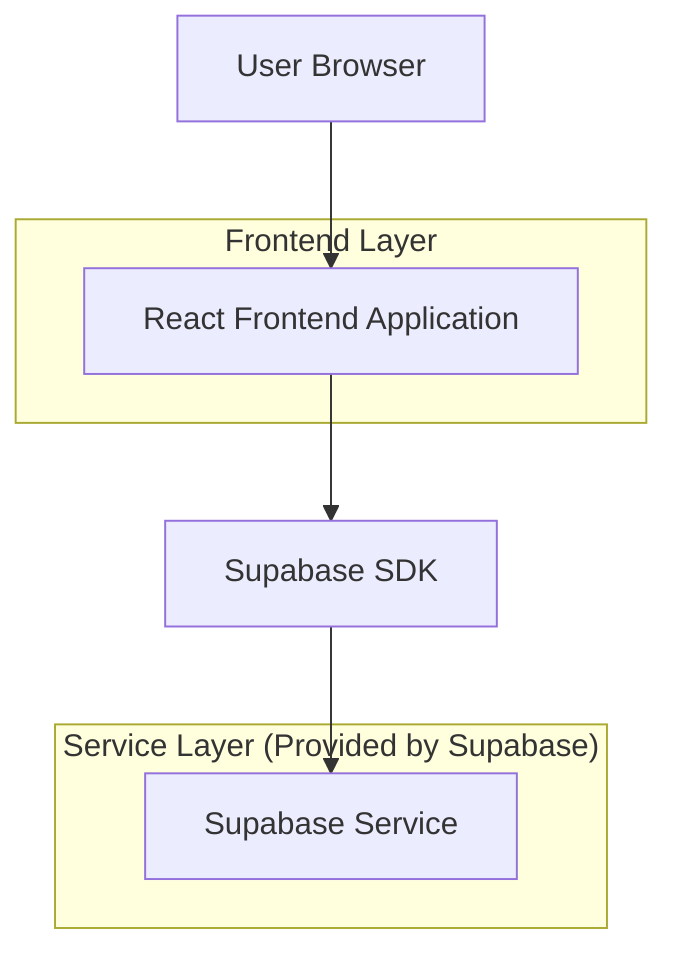
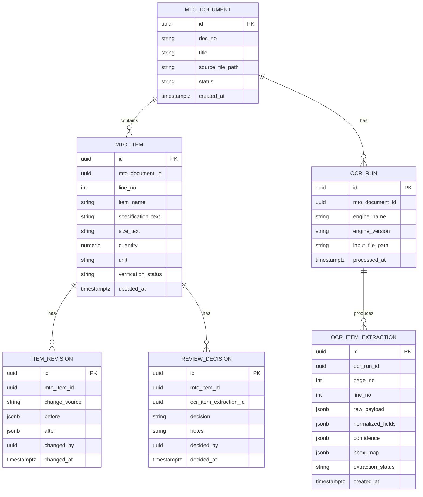

## 1.Architecture design


Catatan: bila hasil OCR datang via proses async (mis. pipeline OCR), opsional gunakan **Supabase Edge Function** untuk menerima webhook dan menulis data ekstraksi; jika OCR di-upload manual (JSON), frontend bisa menulis langsung ke Supabase.

## 2.Technology Description
- Frontend: React@18 + TypeScript + vite + tailwindcss@3
- Backend: Supabase (PostgreSQL + Storage + Auth (opsional, mengikuti sistem akun internal))

## 3.Route definitions
| Route | Purpose |
|-------|---------|
| /data/mto/:docId | Tampilan Data (Detail MTO) + panel OCR compare/verifikasi |
| /review/ocr | Antrian Review OCR (filter, review cepat, batch approve/reject) |
| /history/mto/:docId | Histori Perubahan (timeline + detail diff per item) |

## 6.Data model(if applicable)

### 6.1 Data model definition


### 6.2 Data Definition Language
MTO Document (mto_documents)
```sql
CREATE TABLE mto_documents (
  id UUID PRIMARY KEY DEFAULT gen_random_uuid(),
  doc_no TEXT,
  title TEXT,
  source_file_path TEXT,
  status TEXT DEFAULT 'active',
  created_at TIMESTAMPTZ DEFAULT NOW()
);

GRANT SELECT ON mto_documents TO anon;
GRANT ALL PRIVILEGES ON mto_documents TO authenticated;
```

MTO Item (mto_items)
```sql
CREATE TABLE mto_items (
  id UUID PRIMARY KEY DEFAULT gen_random_uuid(),
  mto_document_id UUID NOT NULL,
  line_no INT,
  item_name TEXT,
  specification_text TEXT,
  size_text TEXT,
  quantity NUMERIC,
  unit TEXT,
  verification_status TEXT DEFAULT 'draft',
  updated_at TIMESTAMPTZ DEFAULT NOW()
);

CREATE INDEX idx_mto_items_doc ON mto_items(mto_document_id);

GRANT SELECT ON mto_items TO anon;
GRANT ALL PRIVILEGES ON mto_items TO authenticated;
```

OCR Run (ocr_runs)
```sql
CREATE TABLE ocr_runs (
  id UUID PRIMARY KEY DEFAULT gen_random_uuid(),
  mto_document_id UUID NOT NULL,
  engine_name TEXT,
  engine_version TEXT,
  input_file_path TEXT,
  processed_at TIMESTAMPTZ,
  created_at TIMESTAMPTZ DEFAULT NOW()
);

CREATE INDEX idx_ocr_runs_doc ON ocr_runs(mto_document_id);

GRANT SELECT ON ocr_runs TO anon;
GRANT ALL PRIVILEGES ON ocr_runs TO authenticated;
```

OCR Item Extraction (ocr_item_extractions)
```sql
CREATE TABLE ocr_item_extractions (
  id UUID PRIMARY KEY DEFAULT gen_random_uuid(),
  ocr_run_id UUID NOT NULL,
  page_no INT,
  line_no INT,
  raw_payload JSONB,
  normalized_fields JSONB,
  confidence JSONB,
  bbox_map JSONB,
  extraction_status TEXT DEFAULT 'parsed',
  created_at TIMESTAMPTZ DEFAULT NOW()
);

CREATE INDEX idx_ocr_extractions_run ON ocr_item_extractions(ocr_run_id);

GRANT SELECT ON ocr_item_extractions TO anon;
GRANT ALL PRIVILEGES ON ocr_item_extractions TO authenticated;
```

Review Decision (review_decisions) dan Item Revision (item_revisions)
```sql
CREATE TABLE review_decisions (
  id UUID PRIMARY KEY DEFAULT gen_random_uuid(),
  mto_item_id UUID NOT NULL,
  ocr_item_extraction_id UUID,
  decision TEXT NOT NULL, -- approved | rejected | needs_fix
  notes TEXT,
  decided_by UUID,
  decided_at TIMESTAMPTZ DEFAULT NOW()
);

CREATE TABLE item_revisions (
  id UUID PRIMARY KEY DEFAULT gen_random_uuid(),
  mto_item_id UUID NOT NULL,
  change_source TEXT NOT NULL, -- ocr_accept | manual_edit | restore
  before JSONB,
  after JSONB,
  changed_by UUID,
  changed_at TIMESTAMPTZ DEFAULT NOW()
);

CREATE INDEX idx_item_revisions_item ON item_revisions(mto_item_id);

GRANT SELECT ON review_decisions, item_revisions TO anon;
GRANT ALL PRIVILEGES ON review_decisions, item_revisions TO authenticated;
```