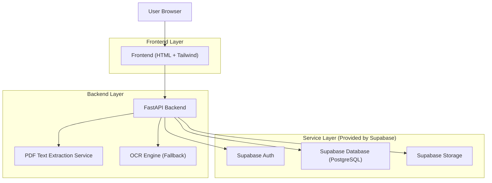
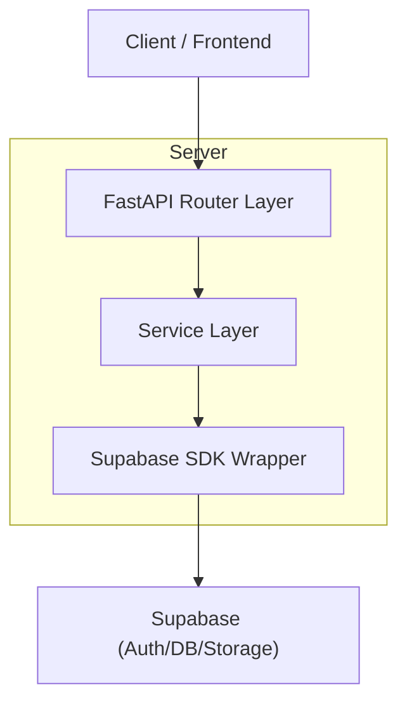
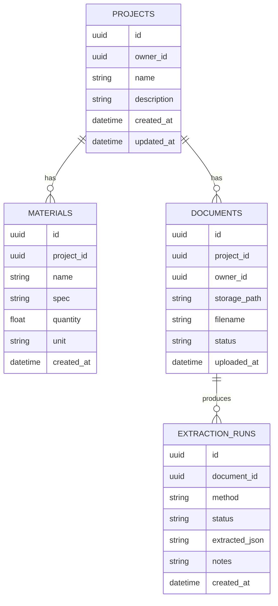

## 1.Architecture design


## 2.Technology Description
- Frontend: HTML5 + tailwindcss@3 (+ Vanilla JS atau Alpine.js opsional untuk interaksi ringan)
- Backend: FastAPI (Python) + Pydantic
- Database & Auth & Storage: Supabase (PostgreSQL + Auth + Storage)
- PDF text extraction (server-side): PyMuPDF (fitz)
- OCR fallback (server-side): Tesseract OCR via pytesseract (membutuhkan binary Tesseract di host)

## 3.Route definitions
| Route | Purpose |
|---|---|
| /login | Halaman login/daftar |
| / | Dashboard ringkasan + daftar/CRUD proyek |
| /projects/{projectId} | Detail proyek (tab Material & Dokumen, upload PDF, ekstraksi, CRUD) |

## 4.API definitions (If it includes backend services)
### 4.1 Core API
Auth (delegasi ke Supabase, dipanggil via backend)
```
POST /api/auth/sign-up
POST /api/auth/sign-in
GET  /api/me
```

Catatan: sistem tidak mewajibkan verifikasi email; sign-up mengembalikan session dan user langsung bisa akses aplikasi.

Operasional: untuk user lama yang masih berstatus belum terkonfirmasi (jika pernah memakai email confirmation), jalankan skrip `backend/scripts/confirm_all_users.py` sekali untuk menyamakan status.

Projects
```
GET    /api/projects
POST   /api/projects
GET    /api/projects/{project_id}
PATCH  /api/projects/{project_id}
DELETE /api/projects/{project_id}
```

Materials
```
GET    /api/projects/{project_id}/materials
POST   /api/projects/{project_id}/materials
PATCH  /api/materials/{material_id}
DELETE /api/materials/{material_id}
```

Documents & Extraction
```
GET    /api/projects/{project_id}/documents
POST   /api/projects/{project_id}/documents        (multipart upload PDF)
GET    /api/documents/{document_id}                (metadata + status)
DELETE /api/documents/{document_id}
POST   /api/documents/{document_id}/extract        (trigger extraction; pdf_text -> OCR fallback)
GET    /api/documents/{document_id}/extraction-runs
PATCH  /api/extraction-runs/{run_id}               (opsional: simpan koreksi manual)
```

Shared data types (ringkas; gaya TypeScript untuk kesamaan kontrak)
```ts
type UUID = string;

type Project = {
  id: UUID;
  owner_id: UUID;
  name: string;
  description?: string;
  created_at: string;
  updated_at: string;
};

type Document = {
  id: UUID;
  project_id: UUID;
  owner_id: UUID;
  storage_path: string;
  filename: string;
  status: "uploaded" | "extracting" | "success" | "failed";
  uploaded_at: string;
};

type ExtractionRun = {
  id: UUID;
  document_id: UUID;
  method: "pdf_text" | "ocr" | "pdf_text_then_ocr";
  status: "success" | "failed";
  extracted_json?: string; // JSON string
  notes?: string;
  created_at: string;
};
```

## 5.Server architecture diagram (If it includes backend services)


## 6.Data model(if applicable)

### 6.1 Data model definition


### 6.2 Data Definition Language
Bucket:
- Storage bucket: project-documents (private)
- Path convention: {owner_id}/{project_id}/{document_id}/{filename}

DDL (tanpa foreign key fisik; relasi via kolom *_id):
```
CREATE TABLE projects (
  id UUID PRIMARY KEY DEFAULT gen_random_uuid(),
  owner_id UUID NOT NULL,
  name TEXT NOT NULL,
  description TEXT,
  created_at TIMESTAMPTZ DEFAULT now(),
  updated_at TIMESTAMPTZ DEFAULT now()
);

CREATE TABLE materials (
  id UUID PRIMARY KEY DEFAULT gen_random_uuid(),
  project_id UUID NOT NULL,
  name TEXT NOT NULL,
  spec TEXT,
  quantity DOUBLE PRECISION,
  unit TEXT,
  created_at TIMESTAMPTZ DEFAULT now()
);

CREATE TABLE documents (
  id UUID PRIMARY KEY DEFAULT gen_random_uuid(),
  project_id UUID NOT NULL,
  owner_id UUID NOT NULL,
  storage_path TEXT NOT NULL,
  filename TEXT NOT NULL,
  status TEXT DEFAULT 'uploaded',
  uploaded_at TIMESTAMPTZ DEFAULT now()
);

CREATE TABLE extraction_runs (
  id UUID PRIMARY KEY DEFAULT gen_random_uuid(),
  document_id UUID NOT NULL,
  method TEXT NOT NULL, -- 'pdf_text' | 'ocr' | 'pdf_text_then_ocr'
  status TEXT NOT NULL, -- 'success' | 'failed'
  extracted_json TEXT,  -- JSON string hasil ekstraksi
  notes TEXT,
  created_at TIMESTAMPTZ DEFAULT now()
);

-- Permissions (ringkas)
GRANT SELECT ON projects, materials, documents, extraction_runs TO anon;
GRANT ALL PRIVILEGES ON projects, materials, documents, extraction_runs TO authenticated;
```
Catatan akses: aktifkan RLS agar user hanya bisa akses baris miliknya (projects.owner_id = auth.uid(); documents.owner_id = auth.uid(); turunan via project_id di level aplikasi/RLS policy).
